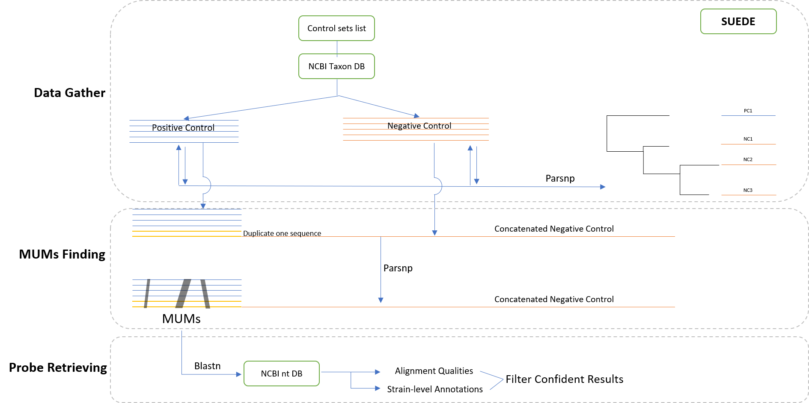

# SUEDE: a Strain-level UniquE DNA probE finder

## Introduction

## Pre-request
#### For genome download of Positive/Negative Group

    ncbi-genome-download: https://github.com/kblin/ncbi-genome-download 

#### For unzip downloaded data

    gunzip

#### For generating and exporting Tables and Heatmap

    pandas: https://pandas.pydata.org/
    seaborn: https://seaborn.pydata.org/

#### For getting Taxon ID from name, printing Newik Tree

    ete3: http://etetoolkit.org/

#### Other Python Libraries:

    os, sys, argparse, numpy, progressbar

#### For getting MUMs

    Built-in Parsnp

    
## Usage

    usage: run.py [-h] [-w WORK_DIR] -c CONFIG_DIR -d DATABASE_PATH [-t]
              [-p PROCESSES] [-m]

    SUEDE: Strain-level UniquE Dna probE finder

    optional arguments:
    -h, --help            show this help message and exit
    -w WORK_DIR, --work_dir WORK_DIR
                            Directory of work directory, default: ../NCBITaxa/
    -c CONFIG_DIR, --config_dir CONFIG_DIR
                            Directory of configuration file
    -d DATABASE_PATH, --database_path DATABASE_PATH
                            Directory of NCBI nt database
    -t, --tree_help       Use parsnp to generate a tree to evaluate positive
                            control? defalut: False
    -p PROCESSES, --processes PROCESSES
                            Threads number, default: 70
    -m, --MUMS_only       Only get MUMs, not blast against database? defalut:
                            False

## Description

### Pileline

### Example Config File

    bacteria

    Mycobacterium tuberculosis

    Mycobacterium bovis
    Mycobacterium smegmatis
    Mycobacterium avium
    Mycobacterium kansasii
    Mycobacterium fortuitum
    Mycobacterium abscessus

- The first Row is the Group that you want to get in NCBI Taxonomy Database
- The second block is the Positive control
- The third block is the Negative control

